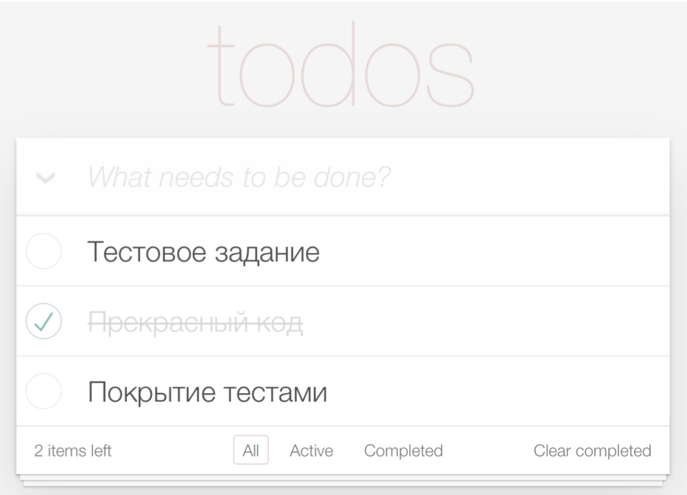

# Тестовое задание Frontend intern в Mindbox 

## Ссылка

Приложение развернуто в [Vercel](https://mindbox-frontend-testtask.vercel.app/).

## Текст ТЗ

Сделайте ToDo-приложение, позволяющее управлять текущим списком дел

Что должно быть в интерфейсе:

- Поле для ввода новой задачи
- Списки задач:
- общий
- невыполненных задач
- выполненных задач
- Количество оставшихся задач
- Очистка выполненных

Пример внешнего вида приложения

 
Требования к коду:

- Приложение создано с использованием TypeScript, React и React Hooks
- Библиотеки компонент – на ваше усмотрение
- Ключевая на ваш взгляд функциональность обязательно покрыта тестами
- Проект должен запускаться командой npm i && npm run start
- Проект доступен на GitHub Pages/Vercel/etc.
